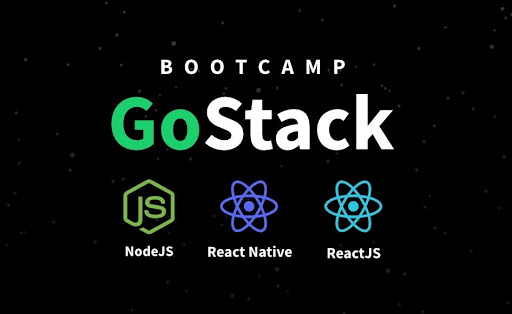

<h1 align="center">Desafios</h1>

  

  
  
  

___

<h3 align="center">
  <a href="#information_source-sobre">Sobre</a>&nbsp;|&nbsp;
  <a href="#book-desafios">Desafios</a>&nbsp;|&nbsp;
  <a href="#rocket-tecnologias-frameworks-dependencias">Tecnologias</a>&nbsp;|&nbsp;
  <a href="#licença">Licença</a>
</h3>

___

 

## :information_source: Sobre

Projetos desenvolvidos com a finalidade de fixar o conteudo apresentado durante as semanas do bootcamp rocketseat.

## :book: Desafios

- [Desafio 01 - Conceitos de Node.js](https://github.com/lirajw/desafio-conceitos-nodejs.git)

 

## Licença 

Esse projeto está sob a licença MIT. Veja o arquivo [LICENSE](LICENSE) para mais detalhes.
